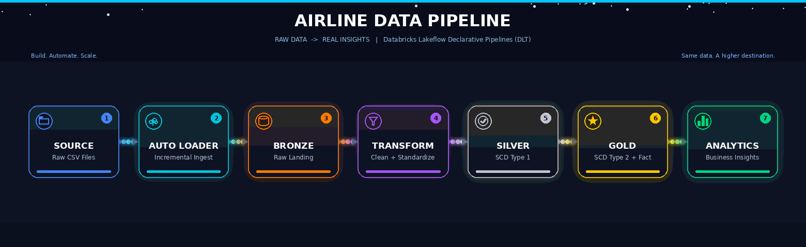
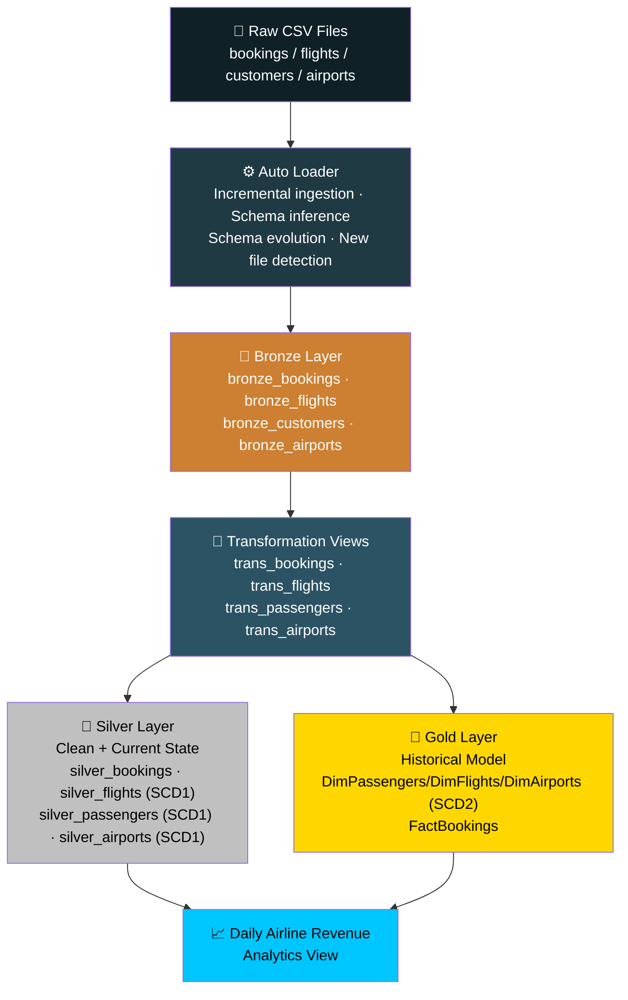
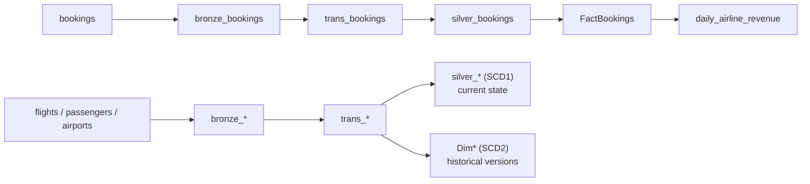

<div align="center">


<a href="https://github.com/kaustavforge">
  
</a>

<br/>

[](https://github.com/kaustavforge)
[](https://www.databricks.com/)
[](https://spark.apache.org/)



</div>

---

## 📌 About the Project

This project implements an end-to-end **Airline Data Engineering Pipeline** on Databricks using the **Medallion Architecture**.

The pipeline ingests airline CSV files incrementally from a Unity Catalog Volume using **Auto Loader**, processes and validates the data through the **Bronze and Silver layers**, and builds a business-ready **Gold dimensional model**.

The project demonstrates how a traditional notebook-based ETL/ELT workflow can be redesigned using a **declarative pipeline approach with DLT**.

The pipeline handles:

- Incremental file ingestion with **Databricks Auto Loader**
- Schema inference and schema evolution
- Bronze raw-data ingestion
- Silver transformation and data quality validation
- **SCD Type 1** for current-state dimension tables
- **SCD Type 2** for full historical dimension tracking
- Generated **surrogate keys**
- Fact and dimension modeling
- Star-schema style analytics
- Incremental analytical processing
- A downstream airline revenue aggregation

---

## 🏗️ Architecture



---

## 🥉 Bronze Layer

The Bronze layer is responsible for ingesting raw airline data with **Auto Loader**.

The source data is organized by domain:

```text
rawdata/
├── bookings/
├── flights/
├── customers/
└── airports/
```

Auto Loader provides incremental file discovery and ingestion while maintaining schema information.

Example:

```python
df = (
    spark.readStream
    .format("cloudFiles")
    .option("cloudFiles.format", "csv")
    .option("header", "true")
    .option("cloudFiles.inferColumnTypes", "true")
    .option("cloudFiles.schemaEvolutionMode", "rescue")
    .load(...)
)
```

The Bronze layer keeps the incoming data close to its original form while adding the CDC ordering information required by the demonstration.

---

## 🥈 Silver Layer

The Silver layer performs **data cleaning, standardization, and validation**.

### Booking transformations

- Cast `amount` to a decimal type
- Convert `booking_date` to a date
- Remove rescued data after handling the ingestion stage
- Apply data quality expectations

Example validation rules include:

```text
booking_id IS NOT NULL
passenger_id IS NOT NULL
flight_id IS NOT NULL
airport_id IS NOT NULL
amount IS NOT NULL AND amount >= 0
booking_date IS NOT NULL
```

### SCD Type 1 Dimensions

The Silver dimension tables maintain the **latest/current state**:

```text
silver_flights
silver_passengers
silver_airports
```

SCD Type 1 means that when an entity changes, the previous value is replaced by the latest value.

---

## 🥇 Gold Layer

The Gold layer contains the business-ready dimensional model.

### SCD Type 2 Dimensions

The following dimensions preserve historical versions:

```text
DimPassengers
DimFlights
DimAirports
```

Each dimension contains a generated surrogate key:

```text
DimPassengersKey
DimFlightsKey
DimAirportsKey
```

and SCD history fields:

```text
__START_AT
__END_AT
```

For example:

```text
DimFlightsKey | flight_id | airline      | __START_AT | __END_AT
----------------------------------------------------------------
1             | F0003     | Lufthansa    | ...        | ...
2             | F0003     | Jet Airways  | ...        | NULL
```

The active version is represented by:

```text
__END_AT IS NULL
```

---

## 📊 FactBookings

The fact table represents the business event at:

> **One row = one booking**

### Fact columns

```text
booking_id
DimPassengersKey
DimFlightsKey
DimAirportsKey
amount
booking_date
```

The fact table stores **foreign/surrogate keys and measures**, rather than copying all descriptive columns from the dimensions.

For example, passenger attributes such as:

```text
name
gender
nationality
```

remain in `DimPassengers`.

Likewise:

```text
airline
origin
destination
```

remain in `DimFlights`.

And:

```text
airport_name
city
country
```

remain in `DimAirports`.

---

## 🔄 Change Data Capture

The project uses:

```python
dlt.create_auto_cdc_flow(...)
```

with:

```python
sequence_by=col("modifiedDate")
```

The `modifiedDate` column establishes the logical order of changes.

For the supplied training files, a deterministic sequence is derived from the file naming convention:

```text
base file        → first version
_increment.csv   → second version
_scd.csv         → later historical version
```

This is a **training/demo mechanism** because the supplied CSV files do not contain a genuine source-system update timestamp.

In a production system, this should be replaced by a real source field such as:

```text
updated_at
event_timestamp
CDC sequence number
```

---

## 📈 Analytics

The pipeline includes a downstream analytical result:

### `daily_airline_revenue`

It calculates:

- Total bookings
- Total revenue
- Average booking amount
- By booking date
- By airline

Conceptually:

```text
FactBookings
      +
DimFlights
      ↓
Group by booking_date + airline
      ↓
daily_airline_revenue
```

Example output:

| booking_date | airline | total_bookings | total_revenue | average_booking_amount |
|---|---|---:|---:|---:|
| 2025-05-01 | Delta | 25 | 100000 | 4000 |
| 2025-05-01 | Qatar Airways | 20 | 80000 | 4000 |

---

## 🧰 Tech Stack

<div align="center">


</div>

<div align="center">

| Technology | Purpose |
|---|---|
|  | Cloud data engineering platform |
|  | Declarative pipeline orchestration |
|  | Data transformation and processing |
|  | Incremental file ingestion |
|  | Reliable storage and table management |
|  | Source file storage |
|  | Current-state dimension management |
|  | Historical dimension management |
|  | Validation and bad-record handling |
|  | Dimensional modeling and analytics |
|  | Version control and project documentation |

</div>

---

## 📁 Project Structure

```text
DLT_Flight_Pipelines/
│
├── transformations/
│   ├── bronze_ingestion.py
│   ├── silver_transformations.py
│   ├── gold_dimensions.py
│   └── gold_fact.py
│
├── assets/
│   └── DLT_Flight_Pipeline_Stylish_Flow.gif
│
└── README.md
```

---

## 🔀 Pipeline Flow

The dependency graph, showing the fact table's path and how each dimension (flights, passengers, airports) branches into both a current-state (SCD1) and historical (SCD2) copy:



This lets the project keep both the latest/current state in Silver and full historical versions in Gold, feeding into the same fact table.

---

## ⭐ Key Data Engineering Concepts Demonstrated

### Medallion Architecture

```text
Bronze → Silver → Gold
```

### Incremental Processing

Only newly discovered/changed source files need to flow through the incremental pipeline rather than manually rebuilding the entire workflow.

### Data Quality

Invalid records are filtered using DLT expectations.

### SCD Type 1

Maintains current/latest dimension state.

### SCD Type 2

Maintains historical dimension versions using surrogate keys and start/end timestamps.

### Declarative Pipelines

The pipeline declares **what each dataset should contain** rather than manually orchestrating notebook execution, `writeStream`, checkpoints, and Delta `MERGE` operations.

---

## 🚀 How to Run

### 1. Upload the project

Upload the repository/files to your Databricks workspace.

### 2. Create/configure the pipeline

Configure the pipeline with the appropriate Unity Catalog catalog and schemas:

```text
Catalog:
airlines_project

Schemas:
bronze
silver
gold
```

### 3. Place source CSV files

Expected structure:

```text
/Volumes/airlines_project/raw/rawvolume/rawdata/

├── bookings/
├── flights/
├── customers/
└── airports/
```

### 4. Add the transformations directory to the pipeline

Use:

```text
transformations/
```

as the source directory containing the Python pipeline definitions.

### 5. Run the pipeline

For the first run or after changing CDC logic, perform a **Full Refresh** so previous pipeline state does not affect the new implementation.

---

## 🧪 Validation Queries

### Check Gold SCD2 history

```sql
SELECT *
FROM airlines_project.gold.DimFlights
WHERE flight_id = 'F0003'
ORDER BY __START_AT;
```

### Check the current dimension version

```sql
SELECT *
FROM airlines_project.gold.DimFlights
WHERE __END_AT IS NULL;
```

### Check fact data

```sql
SELECT *
FROM airlines_project.gold.FactBookings
LIMIT 20;
```

### Check airline revenue

```sql
SELECT *
FROM airlines_project.gold.daily_airline_revenue
ORDER BY booking_date, airline;
```

---

## 💡 Design Decisions

### Why SCD1 in Silver?

Silver represents the **clean, current state** of the dimension entities.

### Why SCD2 in Gold?

Gold is the business-facing warehouse layer where historical dimension changes are valuable for analytics.

### Why surrogate keys?

Surrogate keys allow different historical versions of the same business entity to be represented as separate dimension rows.

### Why `booking_id` as the fact key?

Because the fact grain is:

> **one row per booking**

Therefore `booking_id` identifies the individual business event.

### Why not copy all dimension columns into the fact?

Because that would duplicate descriptive attributes and weaken the dimensional model. The fact references dimensions through surrogate keys.

---

## ⚠️ Important Note About the Demo CDC Timestamp

The supplied source files do not include a genuine source update timestamp.

Therefore, the project derives a deterministic ordering from the training-file names so that SCD Type 1 / Type 2 behavior can be demonstrated consistently.

For production data, use a real CDC ordering field instead of a filename-derived timestamp.

---

## 🎯 Project Goals

This project was built to demonstrate practical data engineering skills including:

```text
✔ Auto Loader
✔ Incremental ingestion
✔ Medallion Architecture
✔ Databricks DLT
✔ PySpark
✔ Data quality rules
✔ CDC
✔ SCD Type 1
✔ SCD Type 2
✔ Surrogate keys
✔ Fact / Dimension modeling
✔ Star-schema concepts
✔ Analytical aggregations
✔ Unity Catalog
```

---

## 📌 Future Improvements

Possible production-level extensions include:

- Add a real source `updated_at` column
- Add point-in-time/as-of dimension lookups for historical facts
- Add more data quality expectations
- Add monitoring and alerting
- Add CI/CD with GitHub
- Add Databricks Asset Bundles
- Add a BI dashboard
- Add automated tests for pipeline transformations

---

## 🏁 Final Result

An end-to-end declarative airline data platform, from raw CSV to business analytics — see the [Architecture](#️-architecture) diagram above for the full flow.

> **Build. Automate. Scale.** ✈️

---

## 📬 Contact

<div align="center">

**Kaustav Roy Chowdhury**

[](https://github.com/kaustavforge)

</div>

