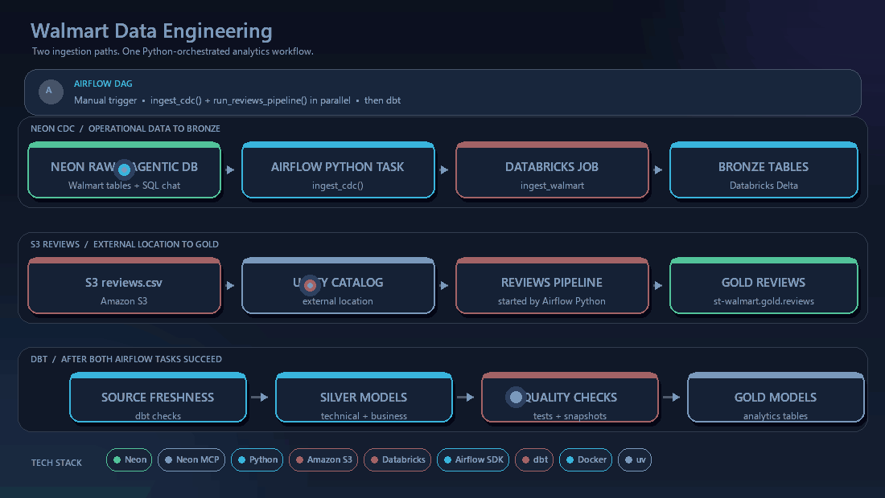
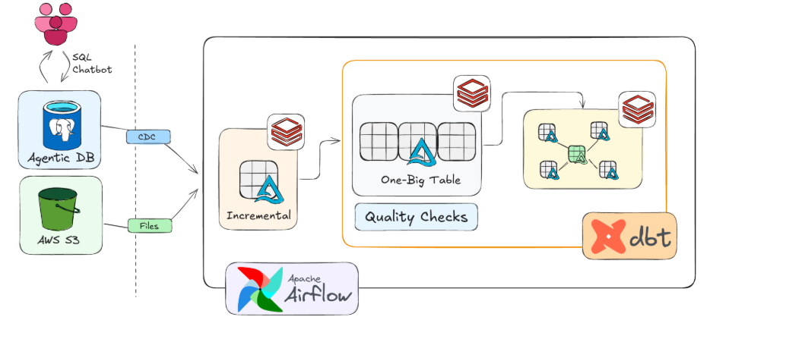
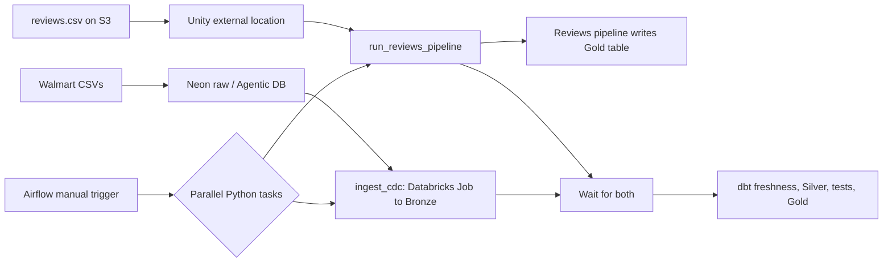

<p align="center">
  
</p>

<p align="center">
  
  
  
  
  
  
  
</p>

# Walmart Data Engineering Project

An end-to-end data engineering project for loading Walmart source data, exploring it with an Agentic DB workflow, ingesting data into Databricks, and preparing analytics models with dbt and Airflow.

## Project overview

The workspace has two parts:

- **Neon and Agentic DB setup** — loads six Walmart CSV datasets into Neon Postgres raw tables with Python and `psycopg2`. Neon MCP supports database exploration through an AI SQL workflow.
- **Databricks lakehouse and orchestration** — ingests operational data into Bronze, reads `reviews.csv` from S3 through a Unity Catalog external location into `st-walmart.gold.reviews`, and runs dbt transformations and quality checks under Airflow.

## Architecture



### Workflow at a glance



The Airflow Python task starts the reviews pipeline directly through the Databricks SDK. The external location gives that pipeline access to S3; the pipeline reads the file and writes the Gold table. It is a separate Airflow task, not a task inside the `ingest_walmart` Databricks Job.

## What each folder contains

### `data_project_setup/`

- `walmart_dataset/data/` — six source CSV files.
- `walmart_dataset/ddl/walmart_schema.sql` — source table definitions.
- `load_data.py` — checks CSV headers, bulk loads into Neon with PostgreSQL `COPY FROM STDIN`, and reports row counts.
- `neon_setup_guide.md` — local Neon setup and development guide.

To load the data, configure `DATABASE_URL` or `DATABASE_URL_UNPOOLED` in the local `.env`, create the `raw` schema and tables, then run from this folder:

```powershell
uv sync
uv run python load_data.py
```

Use `uv run python load_data.py --replace` only when you intend to truncate and reload the raw tables.

### `data_project_dbt/`

Contains the Databricks/Airflow/dbt project. Its [README](data_project_dbt/README.md) covers the implementation and local Airflow workflow in more detail.

- `airflow_dbt_project/dags/orchestrate.py` — active Airflow DAG.
- `airflow_dbt_project/docker-compose.yaml` and `Dockerfile` — local Airflow services and image.
- `walmart_project/` — dbt sources, silver and gold models, tests, snapshots, and macros.
- `IMPLEMENTATION_PLAN.md` — project build order, validation, and commit guide.

## Airflow orchestration

The intended workflow uses two Python tasks in parallel:

1. `ingest_cdc()` starts the Databricks `ingest_walmart` Job and waits for it.
2. `run_reviews_pipeline()` starts the separate reviews pipeline using `DATABRICKS_REVIEWS_PIPELINE_ID` and waits for it.
3. Once both succeed, Airflow runs dbt freshness checks, transformations, tests, snapshots, and gold models.

**Current code status:** The parallel reviews task is in `data_project_dbt/orches-airflow.py.example` as commented example code. The active `data_project_dbt/airflow_dbt_project/dags/orchestrate.py` currently runs only `ingest_cdc()`; integrate the reviews task there before expecting Airflow to start the S3 reviews pipeline.

## Run Airflow locally

1. Start Docker Desktop.
2. Create `data_project_dbt/airflow_dbt_project/.env` locally with:

   ```env
   DATABRICKS_HOST=your-workspace-host
   DATABRICKS_TOKEN=your-token
   DATABRICKS_JOB_ID=your-job-id
   DATABRICKS_REVIEWS_PIPELINE_ID=your-reviews-pipeline-id
   ```

3. From PowerShell, start the stack:

   ```powershell
   cd data_project_dbt/airflow_dbt_project
   docker compose up -d --build
   docker compose ps
   ```

4. Open [Airflow](http://localhost:8080), enable the DAG if paused, and click **Trigger** once.

Use `docker compose up -d` on subsequent starts. Rebuild with `--build` after changing the Dockerfile or requirements. Do not manually start the same Databricks workloads before triggering Airflow; that can create duplicate runs.

## Technology stack

| Area | Tools |
|---|---|
| Source database and Agentic DB | Neon Postgres, Neon MCP |
| Data loading | Python, psycopg2, PostgreSQL COPY |
| Cloud storage | Amazon S3 |
| Lakehouse and ingestion | Databricks, Delta Lake, Unity Catalog |
| Orchestration | Apache Airflow, Databricks SDK |
| Transformation and quality | dbt Core, dbt-databricks, SQL |
| Local development | Docker Compose, Python, uv |

## Security

- Keep both projects' `.env` files out of Git.
- Read credentials from environment variables; never hardcode tokens in source or dbt profiles.
- Revoke and rotate credentials that have been exposed.
- Do not publish private customer/review data, logs, dbt `target/`, or virtual environments.

The two project folders currently have separate Git repositories. This workspace-level README presents them together; pushing either repository alone will not publish the other folder's code.

## Author

**Kaustav Roy Chowdhury**  
[LinkedIn](https://www.linkedin.com/in/kaustavroychowdhury/)

> “Reliable data pipelines turn raw information into decisions people can trust.”

> “Build with curiosity. Validate with discipline. Ship with confidence.”

