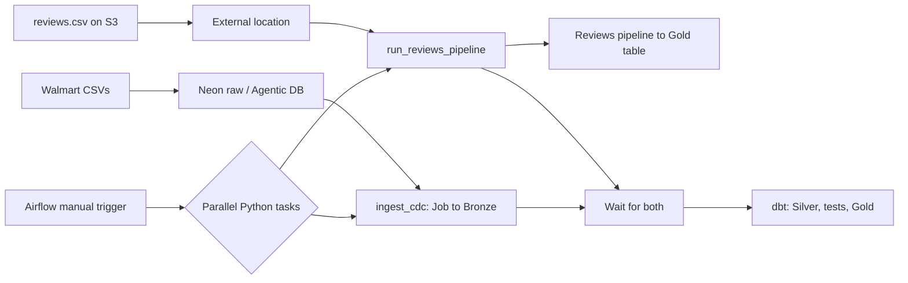

# Walmart Data Engineering Project

<p align="center">
  
</p>

<p align="center">
  
  
  
  
  
  
  
</p>

An end-to-end Walmart data engineering project covering raw data loading, Agentic DB exploration, cloud ingestion, lakehouse transformations, data quality, and workflow orchestration.

## At a glance

- Load six Walmart CSV datasets into Neon Postgres using a Python `psycopg2` bulk loader.
- Explore the Neon database through the Agentic DB workflow using Neon MCP.
- Ingest operational data into Databricks Bronze.
- Read `reviews.csv` from S3 through a Unity Catalog external location and write it to `st-walmart.gold.reviews`.
- Transform and validate analytical data with dbt.
- Orchestrate Databricks and dbt work from Airflow using Python and the Databricks SDK.

## Architecture

### Project diagram


### Simple workflow



The external location grants the Databricks pipeline access to S3. The pipeline performs the actual file read and table write. Airflow starts the reviews pipeline directly with the Databricks SDK; it is a separate Python task, not a task added inside the `ingest_walmart` Databricks Job.

## What the project does

### 1. Prepare the Walmart source database

`data_project_setup/load_data.py` checks CSV headers, loads six datasets into Neon Postgres `raw` tables with PostgreSQL `COPY FROM STDIN`, and prints row counts. Neon MCP supports database schema and SQL exploration through the Agentic DB workflow.

### 2. Ingest into Databricks

The existing `ingest_walmart` Job runs the operational ingestion pipeline and lands source data in Bronze. Separately, the reviews pipeline reads `reviews.csv` from S3 through the external location and writes the Gold reviews table.

### 3. Transform and validate with dbt

The dbt project organizes models into silver technical, silver business, and gold layers. It includes source freshness checks, tests, snapshots, and fact models.

### 4. Orchestrate with Airflow

The intended DAG uses two Python tasks in parallel:

- `ingest_cdc()` starts the Databricks Job with `jobs.run_now()` and waits for completion.
- `run_reviews_pipeline()` starts the reviews pipeline with `pipelines.start_update()` and waits for completion.

After both tasks succeed, the DAG proceeds through the dbt tasks in order.

> **Current code status:** The parallel reviews task is in [orches-airflow.py.example](orches-airflow.py.example) as commented example code. The active DAG at `airflow_dbt_project/dags/orchestrate.py` currently runs only `ingest_cdc()`. Add the reviews task to the active DAG before expecting an Airflow trigger to launch that pipeline.

## Technology stack

| Component | Technologies |
|---|---|
| Data sources and storage | Walmart CSVs, Amazon S3 |
| Operational database | Neon Postgres |
| Agentic DB access | Neon MCP |
| Ingestion and lakehouse | Databricks, Delta Lake, Unity Catalog |
| Orchestration | Apache Airflow, Databricks SDK, Python |
| Transformations and quality | dbt Core, dbt-databricks, SQL |
| Local environment | Docker Compose, Python, uv |

## Repository layout

The local workspace has two sibling Git repositories:

```text
Walmart_Project/
├── architecture.png
├── data_project_setup/           # Neon schema and CSV loader
│   ├── load_data.py
│   ├── neon_setup_guide.md
│   └── walmart_dataset/
│       ├── data/
│       └── ddl/walmart_schema.sql
└── data_project_dbt/             # This repository
    ├── assets/
    │   ├── architecture.png
    │   ├── generate_project_flow.py
    │   └── project-flow.gif
    ├── airflow_dbt_project/
    │   ├── dags/orchestrate.py
    │   ├── Dockerfile
    │   ├── docker-compose.yaml
    │   └── requirements.txt
    ├── walmart_project/          # dbt models, tests, snapshots, macros
    ├── IMPLEMENTATION_PLAN.md
    └── README.md
```

Pushing this repository does not include the sibling `data_project_setup` code. Publish that folder as a companion GitHub repository if you want the full source implementation available to recruiters.

## Run locally

### Requirements

- Docker Desktop with its Linux container engine running.
- Python 3.11+ and uv.
- A Neon project/database for the raw source tables.
- Databricks workspace credentials and permissions to run the Job and reviews pipeline.

### Load CSVs into Neon

From the `data_project_setup` directory, configure `DATABASE_URL` or `DATABASE_URL_UNPOOLED` in its local `.env`, create the `raw` schema/tables, then run:

```powershell
uv sync
uv run python load_data.py
```

Use `uv run python load_data.py --replace` only when you intend to truncate and reload the raw tables.

### Start Airflow

Create `airflow_dbt_project/.env` locally with:

```env
DATABRICKS_HOST=your-workspace-host
DATABRICKS_TOKEN=your-token
DATABRICKS_JOB_ID=your-job-id
DATABRICKS_REVIEWS_PIPELINE_ID=your-reviews-pipeline-id
```

From the Airflow project folder:

```powershell
docker compose up -d --build
docker compose ps
```

Use `--build` after changing the Dockerfile or requirements. Later starts can use `docker compose up -d`.

Open [Airflow](http://localhost:8080), enable the DAG if it is paused, and click **Trigger**. With the parallel reviews task integrated into the active DAG, Airflow starts both Databricks operations and then runs dbt after they succeed. Do not manually start either workload first, to avoid duplicate runs.

## dbt stages

1. Source freshness check.
2. Silver technical models and tests.
3. Silver business models and tests.
4. Gold ephemeral models.
5. Dimension snapshots.
6. Gold fact models.

See [IMPLEMENTATION_PLAN.md](IMPLEMENTATION_PLAN.md) for the full build order, local workflow, validation, and commit guidance.

## Security

- Keep all `.env` files out of Git.
- Read Databricks tokens from environment variables; do not hardcode them in dbt profiles or DAG code.
- Rotate credentials if they have ever been exposed.
- Do not publish private or production customer/review data.
- Keep logs, dbt `target/`, and virtual environments ignored.

## Author

**Kaustav Roy Chowdhury**  
[LinkedIn](https://www.linkedin.com/in/kaustavroychowdhury/)

> “Reliable data pipelines turn raw information into decisions people can trust.”

> “Build with curiosity. Validate with discipline. Ship with confidence.”
